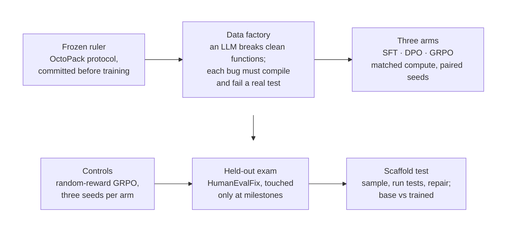
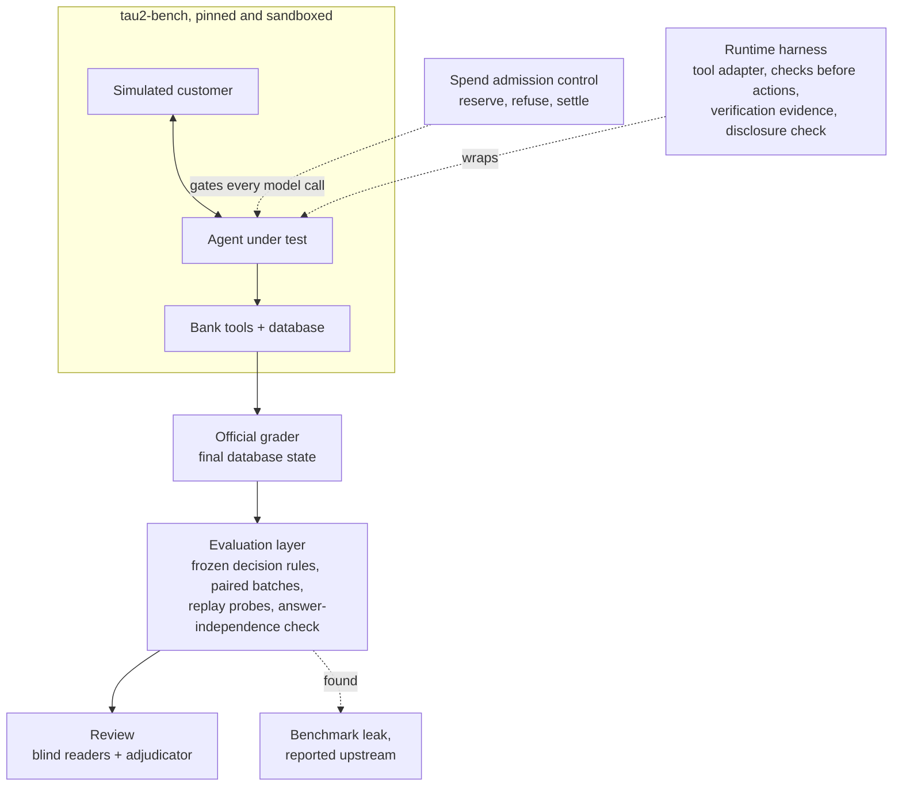

<!-- Generated by tools/build-profile.mjs in nidhi1603/nidhi1603.github.io from the same checked facts as the site. Edit it there. -->

<a href="https://nidhi1603.github.io"><picture><source media="(prefers-color-scheme: dark)" srcset="https://raw.githubusercontent.com/nidhi1603/nidhi1603/main/assets/header-dark.svg"></picture></a>
<a href="https://nidhi1603.github.io"><picture><source media="(prefers-color-scheme: dark)" srcset="https://raw.githubusercontent.com/nidhi1603/nidhi1603/main/assets/terminal-dark.svg"></picture></a>

M.S. Data Science, University at Buffalo (May 2026) · before that, Solutions Engineer at Flipkart (Walmart) · now fine-tuning and evaluating LLMs at Cardio AI

### ⚡ Proof, not adjectives

<a href="https://nidhi1603.github.io/work/post-training-lab/"><picture><source media="(prefers-color-scheme: dark)" srcset="https://raw.githubusercontent.com/nidhi1603/nidhi1603/main/assets/proof-post-training-dark.svg"></picture></a>
<a href="https://nidhi1603.github.io/work/agent-eval-platform/"><picture><source media="(prefers-color-scheme: dark)" srcset="https://raw.githubusercontent.com/nidhi1603/nidhi1603/main/assets/proof-agent-eval-dark.svg"></picture></a>
<a href="https://github.com/langchain-ai/langchain/pull/37157"><picture><source media="(prefers-color-scheme: dark)" srcset="https://raw.githubusercontent.com/nidhi1603/nidhi1603/main/assets/proof-langchain-dark.svg"></picture></a>

Sources: [38.6%](https://github.com/nidhi1603/post-training-lab/blob/eb108d1ee264be1383770c97582c31b5272d853e/README.md#L16) · [30.4%](https://arxiv.org/abs/2308.07124) · [17.6%](https://github.com/nidhi1603/post-training-lab/blob/eb108d1ee264be1383770c97582c31b5272d853e/README.md#L14) · [17 of 30](https://github.com/nidhi1603/agent-eval-platform/blob/ed27c056e28d6c869aad96202b588584a05ddd16/docs/RESULTS.md#L41) · [tau2-bench #574](https://github.com/sierra-research/tau2-bench/issues/574) · [+401/−18 across 9 files](https://github.com/langchain-ai/langchain/pull/37157)

### 👩‍💻 About me

- 🔭 **Now:** fine-tuning and evaluating LLMs at Cardio AI
- 🎯 **Looking for:** AI Engineer, Forward Deployed Engineer and ML Engineer roles in the US
- 🧪 **How I work:** lock the ruler before training, run the control before the claim, publish the null result
- 💬 **Ask me about:** post-training (SFT, DPO, GRPO), agent evaluation, RAG retrieval, LLM integrations
- ⚡ **Fun fact:** a random-reward control showed my own RL gain was noise, and it's my favourite result

### 🔬 Post-Training Lab · SFT vs DPO vs GRPO for code repair

<a href="https://nidhi1603.github.io/work/post-training-lab/"><picture><source media="(prefers-color-scheme: dark)" srcset="https://raw.githubusercontent.com/nidhi1603/nidhi1603/main/assets/ptl-results-dark.svg"></picture></a>
<a href="https://nidhi1603.github.io/results/#ptl"><picture><source media="(prefers-color-scheme: dark)" srcset="https://raw.githubusercontent.com/nidhi1603/nidhi1603/main/assets/ptl-ladder-dark.svg"></picture></a>

- A fine-tuned 1.5B model scores [38.6%](https://github.com/nidhi1603/post-training-lab/blob/eb108d1ee264be1383770c97582c31b5272d853e/README.md#L16) pass@1 on HumanEvalFix (3-seed mean; worst seed [34.5%](https://github.com/nidhi1603/post-training-lab/blob/eb108d1ee264be1383770c97582c31b5272d853e/README.md#L17)), above OctoCoder's [30.4%](https://arxiv.org/abs/2308.07124), a [15.5B](https://arxiv.org/abs/2305.06161) model, under the paper's own frozen protocol.
- **The data won.** [$0.34](https://github.com/nidhi1603/post-training-lab/blob/eb108d1ee264be1383770c97582c31b5272d853e/README.md#L23) of API calls produced [2,551](https://github.com/nidhi1603/post-training-lab/blob/eb108d1ee264be1383770c97582c31b5272d853e/README.md#L24) certified training bugs; each had to compile and fail a real test.
- **The RL didn't.** A GRPO twin trained on a *random* reward matched the real one: real minus random came to [+0.61](https://github.com/nidhi1603/post-training-lab/blob/eb108d1ee264be1383770c97582c31b5272d853e/README.md#L187) pass@1.
- **Scaffold or fine-tune?** In a verify-and-repair loop the untrained base reaches [65.2%](https://github.com/nidhi1603/post-training-lab/blob/eb108d1ee264be1383770c97582c31b5272d853e/README.md#L220), and training adds only [+2.5](https://github.com/nidhi1603/post-training-lab/blob/eb108d1ee264be1383770c97582c31b5272d853e/docs/LAB_NOTEBOOK.md#L1186) points.

[Repo](https://github.com/nidhi1603/post-training-lab) · [Case study](https://nidhi1603.github.io/work/post-training-lab/) · [Lab notebook](https://github.com/nidhi1603/post-training-lab/blob/main/docs/LAB_NOTEBOOK.md) · [Every result](https://nidhi1603.github.io/results/#ptl)

<b>How the study was run</b>

### 🧪 Agent Eval Platform · evaluation machinery for a tool-using banking agent

<a href="https://nidhi1603.github.io/results/#aep"><picture><source media="(prefers-color-scheme: dark)" srcset="https://raw.githubusercontent.com/nidhi1603/nidhi1603/main/assets/aep-findings-dark.svg"></picture></a>
<a href="https://nidhi1603.github.io/work/agent-eval-platform/"><picture><source media="(prefers-color-scheme: dark)" srcset="https://raw.githubusercontent.com/nidhi1603/nidhi1603/main/assets/aep-layers-dark.svg"></picture></a>

- **Found a leak in the benchmark itself.** In [17 of 30](https://github.com/nidhi1603/agent-eval-platform/blob/ed27c056e28d6c869aad96202b588584a05ddd16/docs/RESULTS.md#L41) dev tasks, one listing tool exposed answer-key data to the agent. I reported it as [tau2-bench #574](https://github.com/sierra-research/tau2-bench/issues/574), with a reproducer that needs no model calls.
- **Measured before claiming.** [13](https://github.com/nidhi1603/agent-eval-platform/blob/ed27c056e28d6c869aad96202b588584a05ddd16/docs/RESULTS.md#L80) measurement and harness defects found and fixed, each with a regression test. False "transfer under way" replies fell from [26 of 27 → 2 of 27](https://github.com/nidhi1603/agent-eval-platform/blob/ed27c056e28d6c869aad96202b588584a05ddd16/docs/RESULTS.md#L48) in replay.
- **Reported the null.** Harness vs standard agent: [3 vs 3 of 30](https://github.com/nidhi1603/agent-eval-platform/blob/ed27c056e28d6c869aad96202b588584a05ddd16/docs/RESULTS.md#L31) tasks completed. No gain shown, and the report says so.
- **Try it:** `make demo-provenance` reproduces a verification bug and its fix, offline and at no cost.

[Repo](https://github.com/nidhi1603/agent-eval-platform) · [Case study](https://nidhi1603.github.io/work/agent-eval-platform/) · [Technical report](https://github.com/nidhi1603/agent-eval-platform/blob/main/docs/REPORT.md) · [Every result](https://nidhi1603.github.io/results/#aep)

<b>How the pieces fit</b>

### 🧩 More work

<table>
<tr>
<td width="50%" valign="top">
<b>Code-review LoRA</b> · fine-tuning 
Reasoning-trace SFT on Qwen2.5-Coder-7B that wins <a href="https://github.com/nidhi1603/sft-code-review/blob/79d0f48c576458706b90cd7ab8633666fd4e4314/docs/RESULTS.md#L14">86.0%</a> of head-to-head reviews against the base model (<a href="https://github.com/nidhi1603/sft-code-review/blob/79d0f48c576458706b90cd7ab8633666fd4e4314/docs/RESULTS.md#L14">CI [81.5%, 91%]</a>) and cuts hallucinations <a href="https://github.com/nidhi1603/sft-code-review/blob/79d0f48c576458706b90cd7ab8633666fd4e4314/docs/RESULTS.md#L18">14.5% → 7.0%</a>. Three rounds of RL on top didn't beat it, and the repo says so. 
<a href="https://github.com/nidhi1603/sft-code-review">Repo</a> · <a href="https://nidhi1603.github.io/results/#scr">Results</a>
</td>
<td width="50%" valign="top">
<b>ProofCart</b> · agents and integrations 
Hackathon agent across Slack, Notion and Stripe (test mode): reads supplier threads, waits for the owner's approval in Slack, pays, records. Exactly one charge under crash or duplicate (<a href="https://github.com/nidhi1603/proofcart/blob/52d978bb4c2e5f4f9db4446d90c949ee14a0b1a4/README.md#L84">2/2 vs 0/2</a> against an ablation); <a href="https://github.com/nidhi1603/proofcart/blob/52d978bb4c2e5f4f9db4446d90c949ee14a0b1a4/README.md#L74">14/14</a> deterministic regression cases. 
<a href="https://github.com/nidhi1603/proofcart">Repo</a> · <a href="https://www.loom.com/share/7d9e7c2100a1404fbc9be4f16a613b29">Demo video</a>
</td>
</tr>
<tr>
<td width="50%" valign="top">
<b>Sokratic tutor</b> · group project, my parts 
Multi-agent Socratic tutor (UB). I built the first RAG pipeline (MRR <a href="https://github.com/arun-gg-1996/sokratic-lm/blob/36ba2111d85d67ee70739bff5852a7d9ac63b92e/data/eval/eval_results_2026_04_17.json#L23">0.493</a> → <a href="https://github.com/arun-gg-1996/sokratic-lm/blob/36ba2111d85d67ee70739bff5852a7d9ac63b92e/data/eval/eval_results_2026_04_17.json#L18">0.616</a>), K-of-N partial reach in the reach gate, Haiku behaviour classifiers (<a href="https://github.com/arun-gg-1996/sokratic-lm/blob/0747506df2b080b5a6f9ce4c110c1ae9639e894c/data/artifacts/classifiers/2026-05-01T21-02-26/report.md#L5">29/30</a> on a check set) and an end-to-end regression harness. Reach rate: <a href="https://github.com/arun-gg-1996/sokratic-lm/blob/0747506df2b080b5a6f9ce4c110c1ae9639e894c/docs/HANDOFF_ARUN_2026-05-02.md#L133">38.9% → 66.1%</a> across <a href="https://github.com/arun-gg-1996/sokratic-lm/blob/0747506df2b080b5a6f9ce4c110c1ae9639e894c/docs/HANDOFF_ARUN_2026-05-02.md#L130">59 conversations</a>. 
<a href="https://github.com/arun-gg-1996/sokratic-lm/commits/main?author=nidhi1603">My commits</a> · <a href="https://github.com/arun-gg-1996/sokratic-lm/commits/nidhi/reach-gate-and-override-analysis?author=nidhi1603">My branch</a>
</td>
<td width="50%" valign="top">
<b>Open source</b> · merged pull requests 
<b>LangChain:</b> OpenAI's <code>apply_patch</code> built-in tool for langchain-openai, with unit tests (<a href="https://github.com/langchain-ai/langchain/pull/37157">+401/−18 across 9 files</a>, merged 9 Jun 2026). 
<b>Apache Airflow:</b> a dependency fix in the AWS provider (<a href="https://github.com/apache/airflow/pull/64330">+1/−1 across 1 file</a>, merged 1 Apr 2026). 
 
</td>
</tr>
</table>

### 🧰 Tools I've shipped with

**LLMs and post-training** 

**Agents, RAG and evals** 

**Backend and infrastructure** 

**Data and ML** 

**Integrations** 

### 📈 GitHub activity

<a href="https://github.com/nidhi1603"><picture><source media="(prefers-color-scheme: dark)" srcset="https://raw.githubusercontent.com/nidhi1603/nidhi1603/main/profile-3d-contrib/contrib-dark.svg"></picture></a>

### 📫 Get in touch

Buffalo, NY (Eastern) · open to US-remote and to relocating to the SF Bay Area, NYC or Seattle. 
US work authorization: F-1 OPT, eligible for the 24-month STEM extension (E-Verify employer). I'll need H-1B sponsorship long-term.

Every number on this page links to the line it comes from, in a public repo at a pinned commit. This README is generated from the same checked facts as <a href="https://nidhi1603.github.io">nidhi1603.github.io</a>.
